# Laravel Projects Repository

Welcome to the Laravel Projects Repository! This repository is a collection of Laravel projects that I create for educational purposes and share via YouTube videos. Each project comes with a video tutorial explaining the development process step by step.

## About the Repository

This repository is designed to provide you with practical examples of building web applications using the Laravel framework. Whether you're new to Laravel or looking to enhance your skills, these projects offer hands-on experience and insights into different aspects of web development.

## How to Use

1. Browse the list of projects in this repository.
2. Watch the accompanying YouTube video to follow along with the development process.
3. Use these projects as references, learning materials, or starting points for your own projects.

## Contributions

Contributions to this repository are welcome! If you have ideas for new projects, improvements, or bug fixes, feel free to open an issue or submit a pull request.

## License

This repository and its projects are open-source and available under the [MIT License](LICENSE). Feel free to use, modify, and share the code as you see fit.

## Connect with Me

Find me on YouTube: [Stack Tips](https://www.youtube.com/@OfficialStackTips/videos)

Follow me on Linkedin: [Linkedin](https://www.linkedin.com/in/edris-raufi-93416a4a/)

## Project List

1. **Drop Zone**
   - Description: Upload your files using Drag and Drop.
   - YouTube Video: (https://youtu.be/SdwA3YKW35g)
   

2. **Auto Suggest Search**
   - Description: Auto Suggest the search result like google.
   - YouTube Video: ([https://youtu.be/SdwA3YKW35g](https://youtu.be/7nvN0q77P-k))
   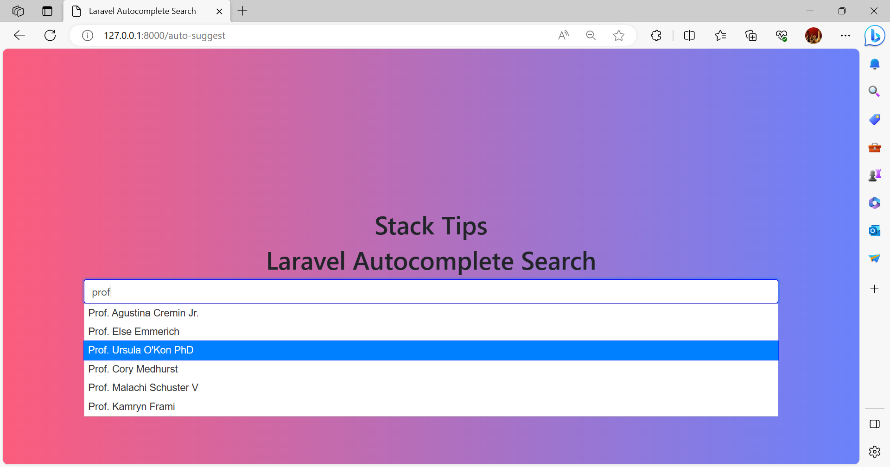

3. **Lazy Loading Images**
- Description: Add Lazy Loading to your images to Load images as you scroll the page.
- YouTube Video: (https://youtu.be/5eG3PIriMgU)
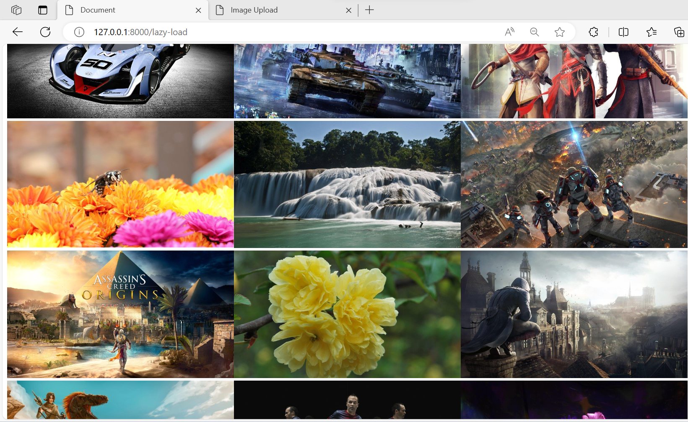

4. **Laravel Excel Import and Export Tutorial with Validation and Toastr Notifications**
- Description: In this comprehensive Laravel tutorial, you'll learn how to build a robust data import and export system using Laravel Excel. We'll cover the entire process, from importing Excel data with validation to exporting data seamlessly. Plus, we'll integrate Toastr notifications to keep your users informed about the import status.
- YouTube Video: (https://youtu.be/BKPkN7XEwxA)
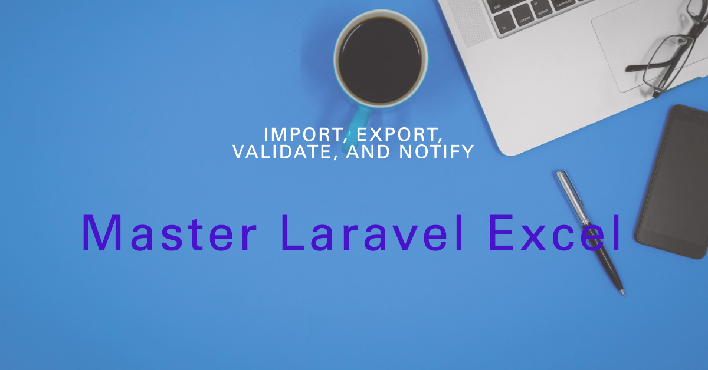

5. **Generate PDF**
- YouTube Video: (https://youtu.be/my9XgQHQoKM)
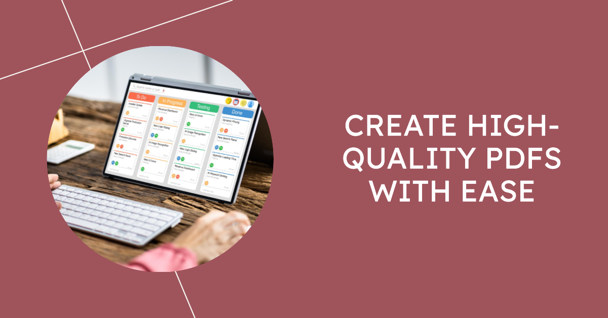

6. **Mastering Laravel CRUD Operations with Form Validation and Notify js**
- Description: In this comprehensive Laravel tutorial, you'll learn how to build a laravel CRUD with Form request validation and notify js
- YouTube Video: (https://youtu.be/5eG3PIriMgU)
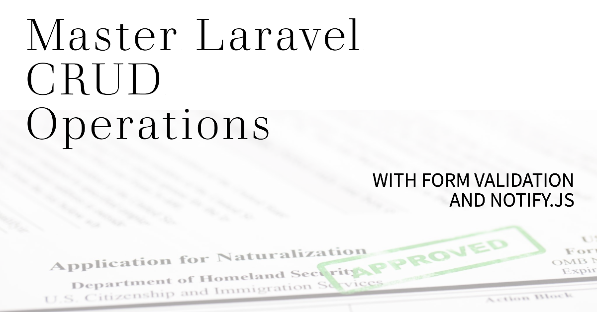

7. **Laravel CSV Data Import and Export**
- Description: In this comprehensive Laravel tutorial, you'll learn how to Import and Export Data using CSV
- YouTube Video: (https://youtu.be/6tEsCSatPXE)

8. **Laravel Multi-Login Authentication Tutorial: Email, Name, and Mobile Number Login**
- Description: In this Laravel tutorial, we'll show you how to implement a multi-login authentication system, allowing users to log in using their email, name, or mobile number. You'll learn step-by-step how to set up Laravel authentication, customize the User model, and modify the login controller to support multiple login methods. By the end of this tutorial, you'll have a secure and flexible authentication system for your Laravel project.
- YouTube Video: (https://www.youtube.com/watch?v=ktTK2LZcyk4)
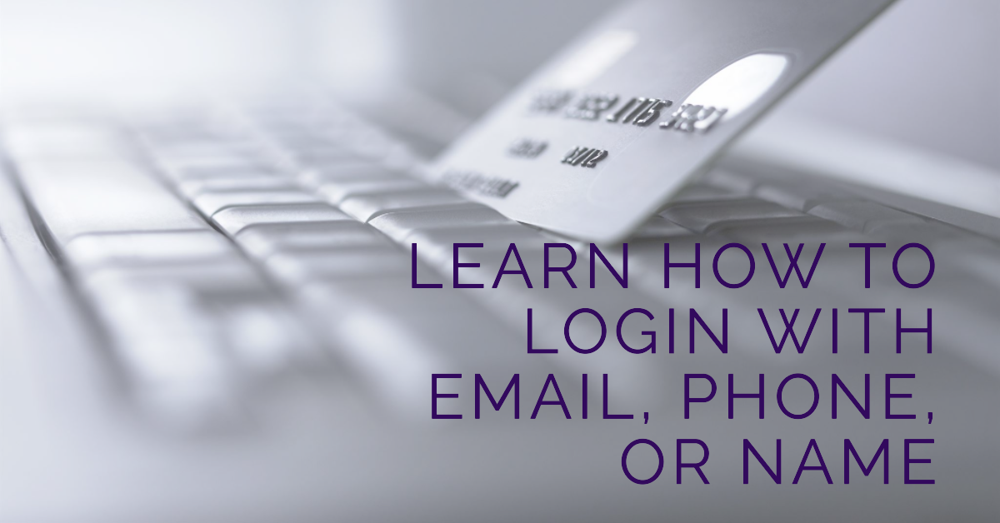

9. **Build a Dynamic Event Calendar with FullCalendar, Laravel and Bootstrap | Web Development Tutorial**
- Description: In this comprehensive web development tutorial, we'll build a dynamic event calendar application from scratch using FullCalendar and Bootstrap. Learn how to create, update, and delete events seamlessly, implement search and filtering functionalities, enhance user experience with interactive design elements, and even export your calendar data to an Excel spreadsheet. Join us to explore the step-by-step process of developing a feature-rich calendar app that's perfect for personal or professional use. Whether you're new to web development or looking to enhance your skills, this tutorial has you covered with hands-on coding examples and user-friendly design tips. Unlock the power of creating stunning event calendars that cater to your needs..
- YouTube Video: (https://youtu.be/KzZR9A7Xk14)

10. **Building a Weather Information App**
- In this tutorial, we'll guide you through creating a Weather Information web application with a stylish user interface using HTML, CSS, and JavaScript. Learn how to fetch weather data from an API, display it beautifully, and allow users to select cities and units. Perfect for web developers looking to enhance their web development skills.
- YouTube Video: (https://youtu.be/Hyw8w65Ru5U)
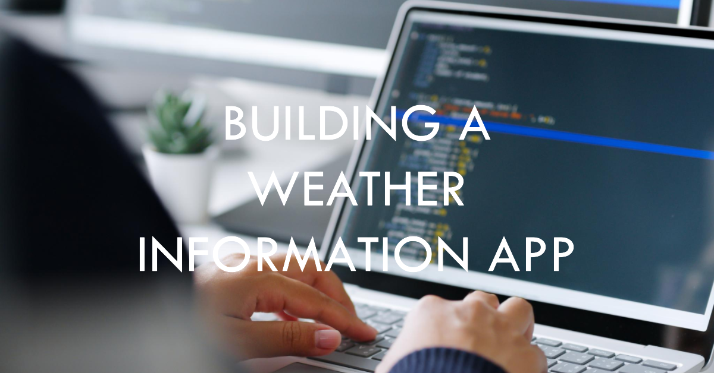

11. **Building a Weather Information App**
- Explore the world of data security with our in-depth "Laravel Encrypt and Decrypt Your Data Tutorial." This step-by-step guide will take you through the process of securing your data in a Laravel application, ensuring your sensitive information remains confidential and protected.
- YouTube Video: (https://youtu.be/E40z1dDL0YY)
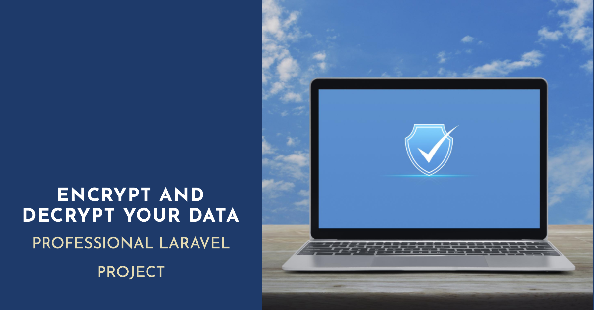

12. **Finding the Slowest SQL Query in Your Application**
- In this tutorial, we'll show you how to set up query logging in Laravel and uncover the slowest SQL queries in your application. We'll guide you through extracting the controller context, database connection, query parameters, and execution plan for each query, highlighting their respective query times. Discover how to identify and optimize the slowest queries, ultimately improving your application's performance.
- YouTube Video: (https://youtu.be/vDFaZ5YZ4pY)
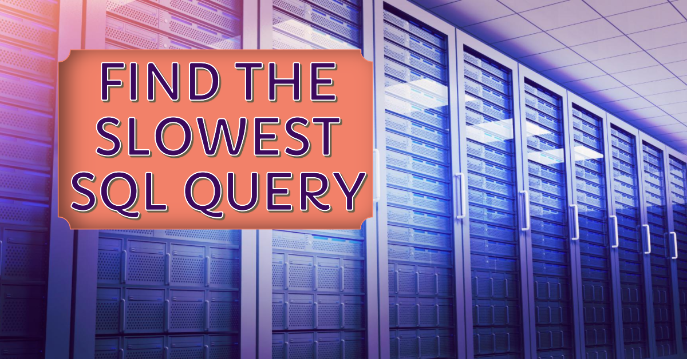

13. **Laravel Dynamic form builder**
- In this tutorial, we'll explore the world of dynamic form creation in a Laravel application. Learn how to build custom forms that adapt to your needs, and implement the essential CRUD (Create, Read, Update, Delete) operations seamlessly.

We'll guide you through setting up a dynamic form builder in your Laravel project, showing you how to create, read, update, and delete data efficiently. Whether you're a seasoned developer or just getting started, this tutorial equips you with the skills to master dynamic forms and build versatile applications. Join us and take your Laravel development to the next level!
- YouTube Video: (https://youtu.be/VXFSe-D5SCA)
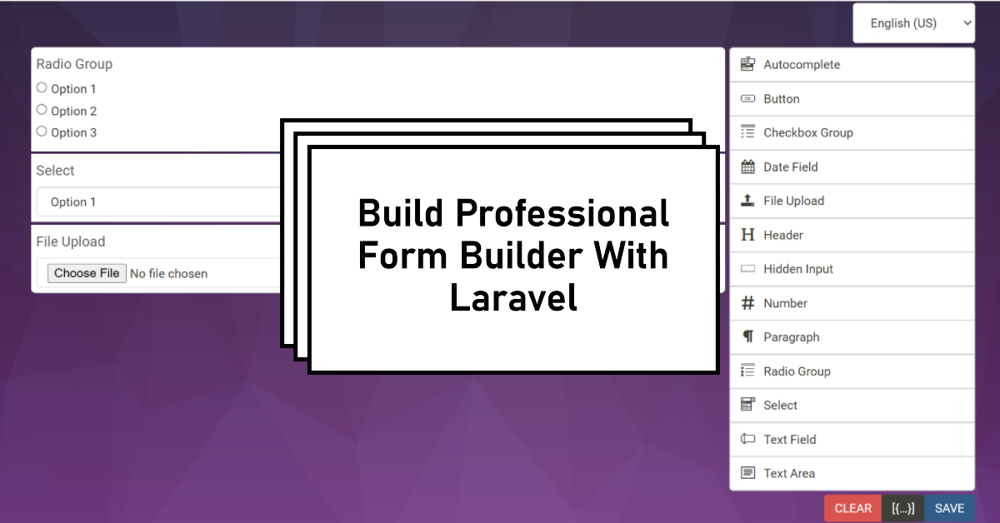

14. **Building an Image Upload and Crop Feature with Laravel and Cropper.js**
- In this tutorial, we'll guide you through the process of building a dynamic image upload and crop feature using Laravel on the backend and Cropper.js on the frontend. Learn how to create an intuitive and user-friendly interface for uploading, cropping, and saving images seamlessly.

- YouTube Video: (https://youtu.be/zT3somYJGAE)
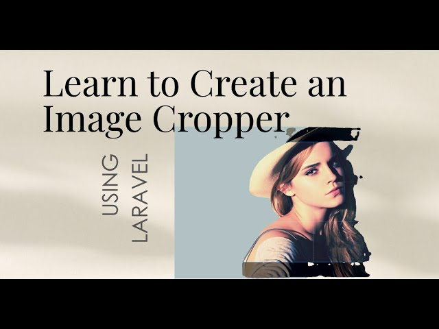

15. **Mastering Laravel Dusk: End-to-End Testing Made Easy | Laravel Dusk Tutorial**
- Laravel Dusk provides an expressive, easy-to-use browser automation and testing API. By default, Dusk does not require you to install JDK or Selenium on your local computer. Instead, Dusk uses a standalone ChromeDriver installation. However, you are free to utilize any other Selenium compatible driver you wish.

- YouTube Video: (https://youtu.be/zT3somYJGAE)
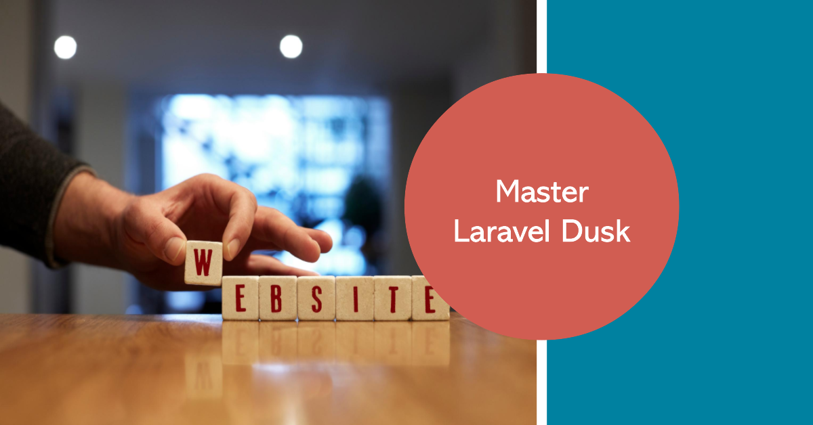
...
