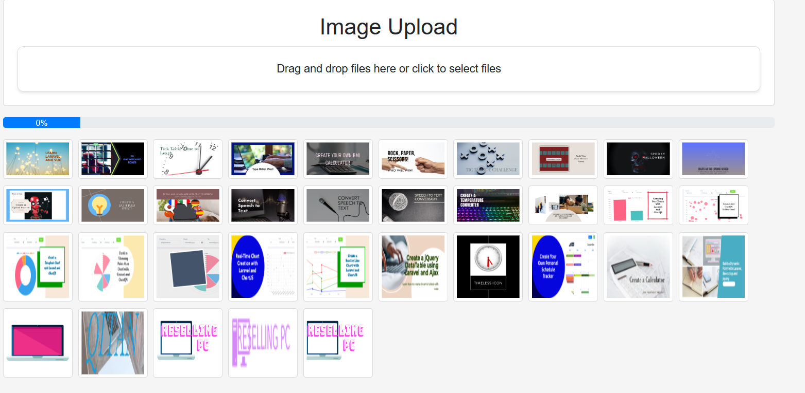

# Laravel Projects Repository

Welcome to the Laravel Projects Repository! This repository is a collection of Laravel projects that I create for educational purposes and share via YouTube videos. Each project comes with a video tutorial explaining the development process step by step.

## About the Repository

This repository is designed to provide you with practical examples of building web applications using the Laravel framework. Whether you're new to Laravel or looking to enhance your skills, these projects offer hands-on experience and insights into different aspects of web development.

## How to Use

1. Browse the list of projects in this repository.
2. Watch the accompanying YouTube video to follow along with the development process.
3. Use these projects as references, learning materials, or starting points for your own projects.

## Contributions

Contributions to this repository are welcome! If you have ideas for new projects, improvements, or bug fixes, feel free to open an issue or submit a pull request.

## License

This repository and its projects are open-source and available under the [MIT License](LICENSE). Feel free to use, modify, and share the code as you see fit.

## Connect with Me

Find me on YouTube: [Stack Tips](https://www.youtube.com/@OfficialStackTips/videos)

Follow me on Linkedin: [Linkedin](https://www.linkedin.com/in/edris-raufi-93416a4a/)

## Project List

1. **Drop Zone**
   - Description: Upload your files using Drag and Drop.
   <!-- - YouTube Video: [Link to YouTube Video](https://youtube.com/your-video-link) -->
   

...
